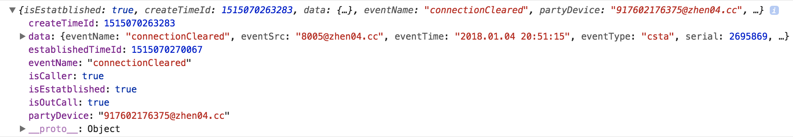

<!-- TOC -->

- [1. 事件订阅](#1-事件订阅)
  - [1.1. wellClient.on(eventName,callback):事件订阅函数 :white_check_mark:](#11-wellclientoneventnamecallback事件订阅函数-white_check_mark)
  - [1.2. wellClient.innerOn(evnentName, callback(data){}): 订阅内部事件 :white_check_mark:](#12-wellclientinneronevnentname-callbackdata-订阅内部事件-white_check_mark)
  - [1.3. 订阅挂断事件：connectionCleared](#13-订阅挂断事件connectioncleared)
  - [1.4. 订阅登录失败事件：loginFailed](#14-订阅登录失败事件loginfailed)
  - [1.5. 订阅websocket断开事件：wsDisconnected](#15-订阅websocket断开事件wsdisconnected)
  - [1.6. 订阅状态恢复成功事件：recoverStateSuccess](#16-订阅状态恢复成功事件recoverstatesuccess)
  - [1.7. wellClient.exports=function(event){}: 所有事件的回调函数 :white_check_mark:](#17-wellclientexportsfunctionevent-所有事件的回调函数-white_check_mark)
  - [1.8. wellClient.onLog=function(msg){}: 所有日志的回调函数 :white_check_mark:](#18-wellclientonlogfunctionmsg-所有日志的回调函数-white_check_mark)

<!-- /TOC -->

# 1. 事件订阅

1. 注意：**软电话的事件只能订阅一次**
如下文所示，两段代码都订阅了`delivered`事件，但是只有后面的订阅的函数会执行。
`wellClient.exports()`也是只能订阅一次。

```
wellClient.on('delivered',function(data){
    做事情A
});

wellClient.on('delivered',function(data){
    做事情B
});
```

2. 注意：**不要在方法内部订阅事件，所有事件都可以在登录方法调用前订阅**


```
// bad 
wellClient.makeCall()
.done(function(...){
    ... 
    wellClient.on('delivered',function(data){
        做事情
    });
})
.fail()
```

3. 注意：**软电话发出的事件种类很多，你只需要关注你需要的事件，不需要的事件可以忽略**

[⬆ 回到顶部](#1-事件订阅)

## 1.1. wellClient.on(eventName,callback):事件订阅函数 :white_check_mark:

参数 | 类型 | 是否必须 |  默认值 | 描述
---|---|---|---|---
eventName | string | 是 |  | 必须是合法的事件名称
callback | function | 是 |  | 事件的回调函数

`Example`

```
// 订阅服务初始化事件
wellClient.on('delivered',function(data){
    wellClient.log('主叫号码'+ data.callingDevice);
    wellClient.log('被叫号码'+ data.calledDevice);

    做你想做的事情
});
```

[⬆ 回到顶部](#1-事件订阅)

## 1.2. wellClient.innerOn(evnentName, callback(data){}): 订阅内部事件 :white_check_mark:

> wellClient.on 与 wellClient.innerOn的区别是：on主要是用来订阅原始呼叫事件，innerOn用来订阅处理后的事件，处理后的事件上往往带有一些原始事件没有的字段，例如connectionCleared的`createTimeId`或`establishedTimeId`字段；innerOn目前只支持订阅三个事件。

[⬆ 回到顶部](#1-事件订阅)

## 1.3. 订阅挂断事件：connectionCleared

参数 | 类型 | 是否必须 |  默认值 | 描述
---|---|---|---|---
eventName | string | 是 |  | 必须是合法的事件名称
callback | function | 是 |  | 事件的回调函数
data.isEstatblished | boolean | | | 挂断前，该通话是否处于通话中。如果处于通话中，则为true。如果振铃未接等情况，则为false
data.createTimeId | int | | | 呼叫产生时间戳
data.establishedTimeId | int | | | 呼叫接通时产生时间戳，如果呼叫没接通，该值为空字符串
data.data | object | | | 原始的event对象
data.eventName | string | | | 事件类型名
data.partyDevice | string | | | 相对于座席的对方号码。注意：在三方或者三方以上通话时，该值为空字符串
data.isCaller | boolean | | | 呼叫类型，如果该值为true,那么就是呼出; 如果该值为false, 那么就是呼入。注意：在三方或者三方以上的通话时，该值为空字符串。
data.isOutCall | boolean | | | 是否是内外线之间的呼叫。true为是，false为内线之间呼叫


`Example`

```
wellClient.innerOn('connectionCleared', function(data){
  console.log(data);
});
```


[⬆ 回到顶部](#1-事件订阅)

## 1.4. 订阅登录失败事件：loginFailed
事件字段 | 类型 | 描述
---|---|---
eventName | string | 事件名
status | int | 状态码。状态码参考 [### 2.3.1. 登录错误码说明](./core-api.md#231-登录错误码说明)
responseText | string | 原因短语（原因短语是原始的英文短语）


`Example`

```
wellClient.innerOn('loginFailed', function(data){
  console.log(data);
});
```

[⬆ 回到顶部](#1-事件订阅)

## 1.5. 订阅websocket断开事件：wsDisconnected

`注意`：websocket断开后，不会立即调用这个事件处理函数。因为wellClient会去尝试重连，最多重连5次，每隔1秒钟
去重连1次。如果5次都重连失败，那么会发送wsDisconnect事件，调用wsDisconnect的事件处理函数。

事件字段 | 类型 | 描述
---|---|---
eventName | string | 事件名
msg | string | 原因短语

`Example`

```
wellClient.innerOn('wsDisconnected', function(data){
  console.log(data);
  // data like this:
  //{
  //  eventName: 'wsDisconnected',
  //  msg: 'websocket disconnect'
  //}
});
```

[⬆ 回到顶部](#1-事件订阅)

## 1.6. 订阅状态恢复成功事件：recoverStateSuccess

```
wellClient.innerOn('recoverStateSuccess', function(e){
	console.log(e)
})

// 事件结构如下
// call对象是可选的，如果状态恢复时座席不是出于通话状态，则没有call对象
// call.state 可能有两个值。established代表通话中，delivered代表振铃中
// 如果呼叫处于established状态中，那么客户端也不会收到established事件
// 如果呼叫处于delivered状态，那么客户端也不会收到delivered，wellClient会更具配置的autoAnswer字段判断是否需要自动应答，如果应答成功，会触发establisheds事件
// 综上：已经发生的事件是不会再次触发的，未来的事件还是会触发

{
  "eventName": "recoverStateSuccess",
  "agentId": "5001@bzkun.cc",
  "extensionId": "8004@bzkun.cc",
  "agentMode": "NotReady",
  "agentName": "sdf",
  "call": {
    "callId": "f268cf58-c0eb-4098-a2a4-1c807ca9d556",
    "callingDevice": "8004@bzkun.cc",
    "calledDevice": "8005@bzkun.cc",
    "state": "established"
  }
}
```


[⬆ 回到顶部](#1-事件订阅)

## 1.7. wellClient.exports=function(event){}: 所有事件的回调函数 :white_check_mark:
第三方自行实现这个函数后，一旦收到事件，就会调用这个函数。

```
wellClient.exports = function(event){
    console.log('receive event: >>>');
    console.log(event);
};
```

[⬆ 回到顶部](#1-事件订阅)

## 1.8. wellClient.onLog=function(msg){}: 所有日志的回调函数 :white_check_mark:
msg结构

字段 | 类型 | 含义
--- | --- | ---
msg.type | 枚举('log', 'error', 'alert') | 消息类型
msg.content | string | 消息内容

第三方自行实现这个函数后，一旦收到打印日志事件，就会回调这个函数
```
wellClient.onLog = function(msg){
    console.log(msg.type);
    console.log(msg.content);
}
```

[⬆ 回到顶部](#1-事件订阅)