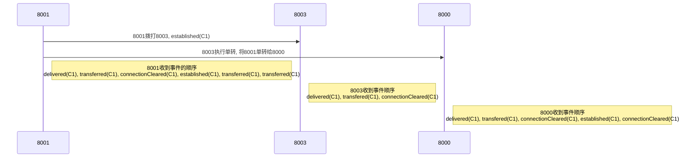
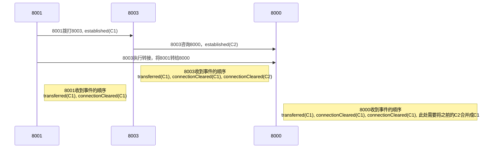

# 单步转接



# 咨询后转接



# 转接事件结构示例

单转
```
{
  "eventName": "transferred",
  "eventSrc": "8001@jasmine.cc",
  "eventTime": "2018.03.13 16:08:44",
  "eventType": "csta",
  "serial": 2466,
  "namespace": "jasmine.cc",
  "srcDeviceId": "8001@jasmine.cc",
  "callId": "f0cf13a9-4a58-44ba-9ecc-929236529755",
  "deviceId": "8000@jasmine.cc",
  "localState": "Connect",
  "connectionId": "8001@jasmine.cc|f0cf13a9-4a58-44ba-9ecc-929236529755",
  "cause": "SINGLESTEPTRANSFER",
  "primaryOldCall": "f0cf13a9-4a58-44ba-9ecc-929236529755",
  "secondaryOldCall": "f0cf13a9-4a58-44ba-9ecc-929236529755",
  "transferringDevice": "8003@jasmine.cc@jasmine.cc",
  "transferredToDevice": "8000@jasmine.cc",
  "newCall": "f0cf13a9-4a58-44ba-9ecc-929236529755"
}
```

咨询后转接
```
{
  "eventName": "transferred",
  "eventSrc": "8000@jasmine.cc",
  "eventTime": "2018.03.13 16:12:37",
  "eventType": "csta",
  "serial": 2497,
  "namespace": "jasmine.cc",
  "srcDeviceId": "8000@jasmine.cc",
  "callId": "d50c3279-3ca3-49f7-9b45-7c7f787d74ea",
  "deviceId": "8000@jasmine.cc",
  "localState": "Connect",
  "connectionId": "8000@jasmine.cc|3fb645c8-2696-11e8-ad41-e164e7ca8097",
  "cause": "TRANSFER",
  "primaryOldCall": "d50c3279-3ca3-49f7-9b45-7c7f787d74ea",
  "secondaryOldCall": "edd81444-bfe0-4656-a95f-7b53dc5c6076",
  "transferringDevice": "8003@jasmine.cc",
  "transferredToDevice": "8000@jasmine.cc",
  "newCall": "d50c3279-3ca3-49f7-9b45-7c7f787d74ea"
}
```

- primaryOldCall: 转移前被保持的呼叫
- secondaryOldCall: 转移前活动的呼叫
- transferringDevice: 发起转移的设备
- transferredToDevice: 转移的目标设备
- newCall: 转移后的呼叫ID 
- cause: 转接原因 SINGLESTEPTRANSFER(单转)，TRANSFER(咨询后转)

# 结论
从图中可以看出
- 单步转移是不会产生新的callId
- 咨询后产生新的callId, 所以如果这一步存在转接，那么背转接方一定需要改变callId
- 挂断事件必须要根据releasingDevice去判断，是自己分机再去挂断
- 那点是如何区分单转还是咨询后转接
- 还有一点，当收到转接事件时，自己要不要处理

# 难点：挂断事件处理
- 如果releaseingDevice是自己，就处理，否则就不处理

# 难点：转接事件的处理
- 如果是单转，则不处理
- 如果是咨询后转接，看
- 当收到转接事件时，是否处理该事件