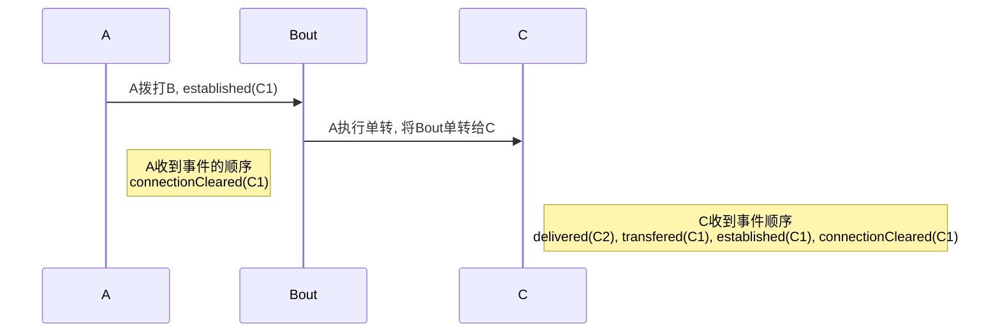
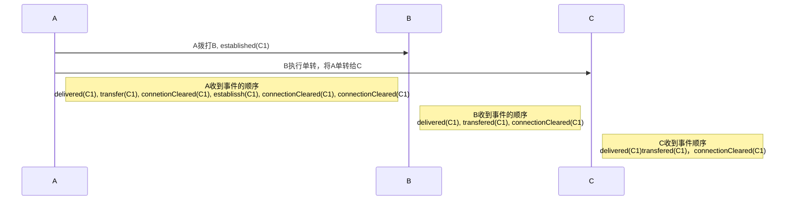

# 单步转接

```mermaid
sequenceDiagram
    participant A
    participant Bout
    participant C
    A->>Bout: A拨打B, established(C1)
    Bout->>C: A执行单转, 将Bout单转给C
    Note right of A: A收到事件的顺序<br/> connectionCleared(C1)
    Note right of C: C收到事件顺序<br/>delivered(C2), transfered(C1), established(C1), connectionCleared(C1)
```

# 分机之间单转

```mermaid
sequenceDiagram
    participant A
    participant B
    participant C
    A->>B: A拨打B, established(C1)

    A->>C: B执行单转，将A单转给C
    Note right of A: A收到事件的顺序<br/> delivered(C1), transfer(C1), connetionCleared(C1), establissh(C1), connectionCleared(C1), connectionCleared(C1)
    Note right of B: B收到事件的顺序<br/>delivered(C1), transfered(C1), connectionCleared(C1)
    
    Note right of C: C收到事件顺序<br/>delivered(C1)transfered(C1)，connectionCleared(C1)
```