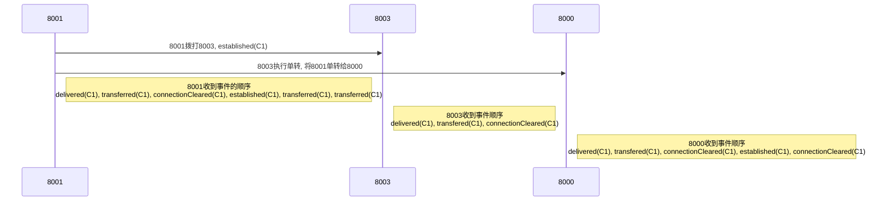
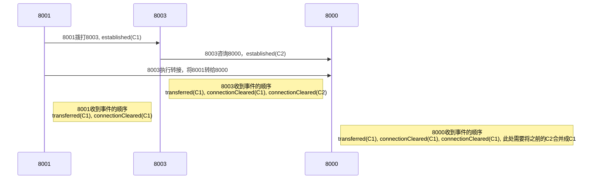

# 单步转接

```mermaid
sequenceDiagram
    participant 8001
    participant 8003
    participant 8000
    8001->>8003: 8001拨打8003, established(C1)
    8001->>8000: 8003执行单转, 将8001单转给8000
    Note right of 8001: 8001收到事件的顺序<br/> delivered(C1), transferred(C1), connectionCleared(C1), established(C1), transferred(C1), transferred(C1)
    Note right of 8003: 8003收到事件顺序<br/>delivered(C1), transfered(C1), connectionCleared(C1)
    Note right of 8000: 8000收到事件顺序<br/>delivered(C1), transfered(C1), connectionCleared(C1), established(C1), connectionCleared(C1)
```

# 咨询后转接

```mermaid
sequenceDiagram
    participant 8001
    participant 8003
    participant 8000
    8001->>8003: 8001拨打8003, established(C1)

    8003->>8000: 8003咨询8000，established(C2)
    8001->>8000: 8003执行转接，将8001转给8000
    Note right of 8003: 8003收到事件的顺序<br/> transferred(C1), connectionCleared(C1), connectionCleared(C2)
    Note right of 8001: 8001收到事件的顺序<br/> transferred(C1), connectionCleared(C1)
    Note right of 8000: 8000收到事件的顺序<br/> transferred(C1), connectionCleared(C1), connectionCleared(C1), 此处需要将之前的C2合并成C1
```